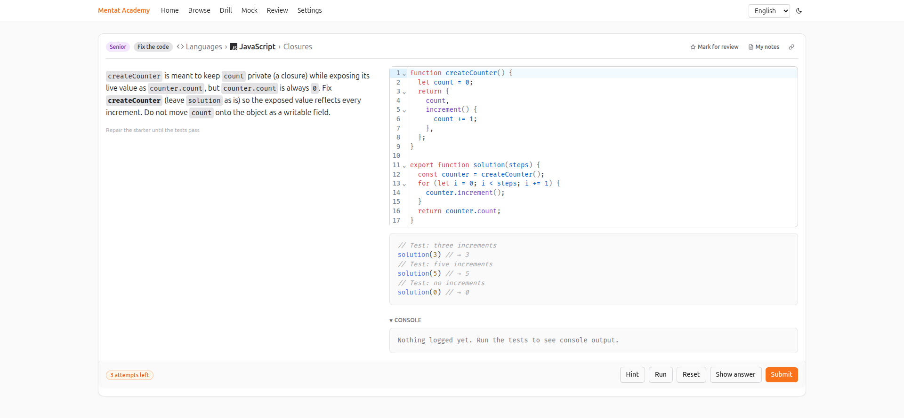
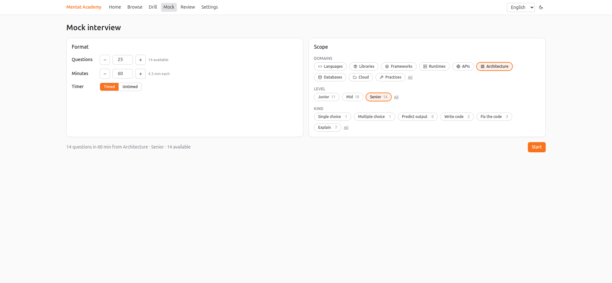
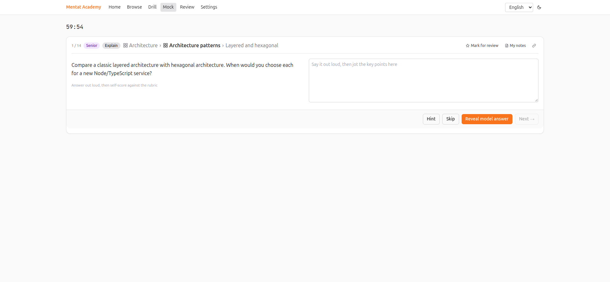
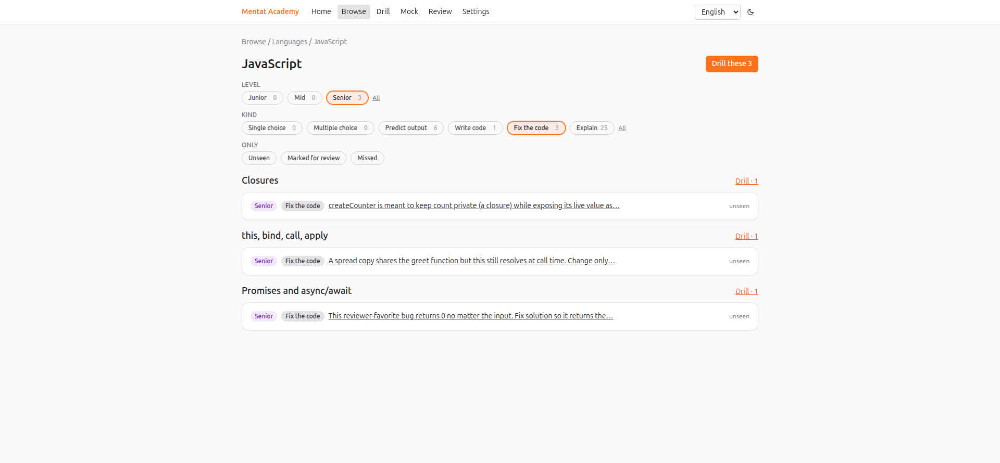
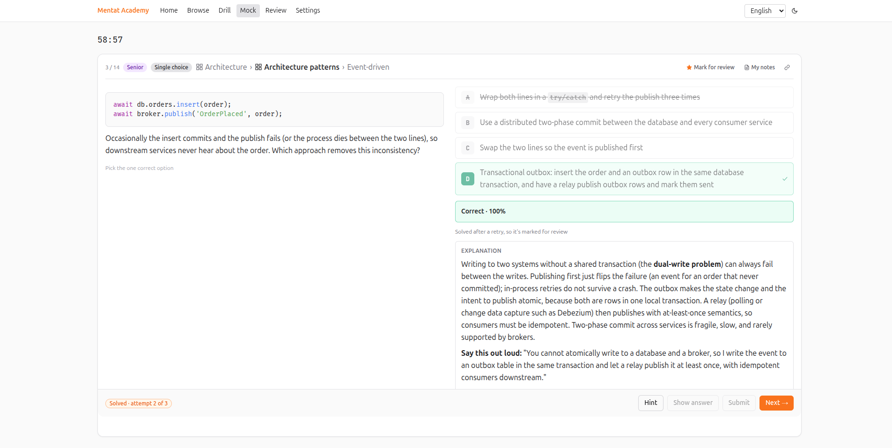
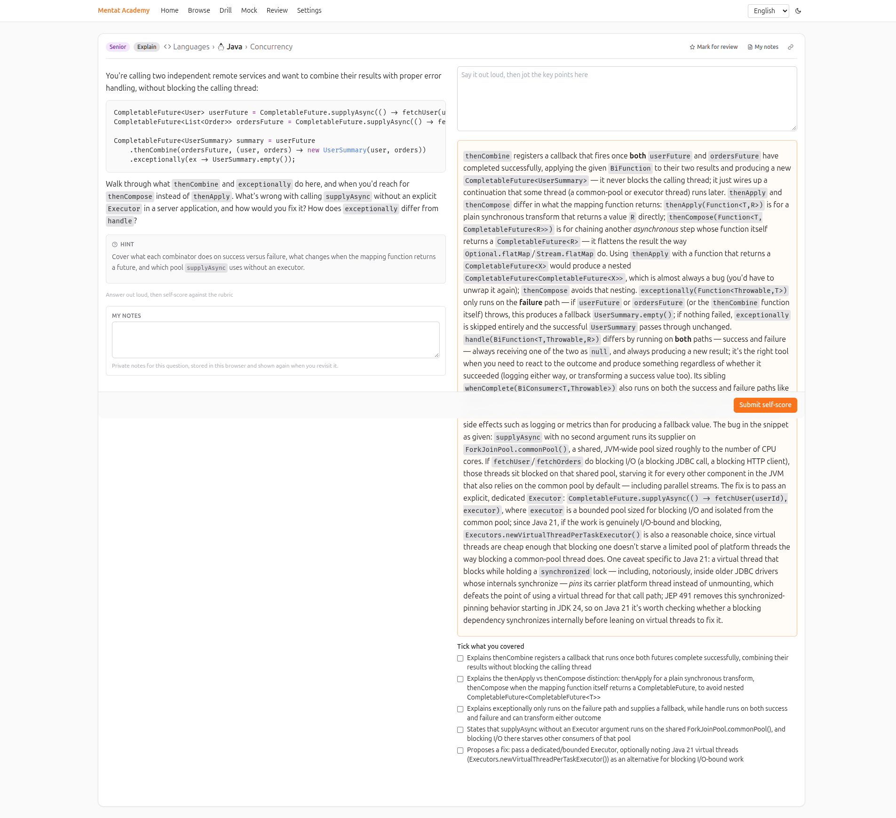
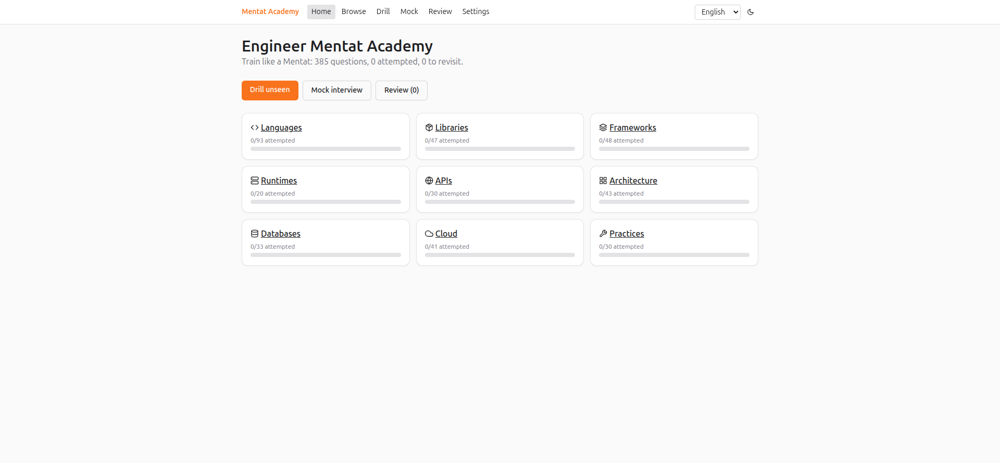

# Engineer Mentat Academy

**Drill for your next senior engineering interview, offline, in your browser.** 385 questions
across languages, libraries, frameworks, runtimes, APIs, architecture, databases, cloud and
engineering practices, from junior fundamentals to senior trade-offs, in English and Spanish.
Write real code against hidden tests, predict what a snippet prints, query a SQLite database,
or talk through a design and score yourself against a rubric. Nothing leaves your machine.

Live at **[jorius.github.io/engineer-mentat-academy](https://jorius.github.io/engineer-mentat-academy/)**,
or [run your own copy](#run-it-yourself).



## A word of caution

This project was vibe-coded in a single day: AI agents wrote most of the code and all of the
questions, hints and translations, then other agents audited and fixed them. It is a study aid,
not a reference. Some answers, explanations or hints may be wrong, outdated or debatable, and the
runtime versions a question assumes may have moved on. Bring your own judgement: when something
looks off, check the official documentation and primary sources before you commit it to memory,
and open an issue or a pull request so it gets fixed. Treating every marked answer as a claim to
verify is good interview practice anyway.

## Why it exists

Interview prep sites are either flash cards or a paywall. This is a study workbench: every
question has an explanation that teaches the rule, a hint that points at the concept without
giving it away, retries, and a "say this out loud" line for the senior ones so you practise the
answer you will actually give.

## What you can practise

| Domain | Subjects |
| --- | --- |
| Languages | JavaScript (56), TypeScript (21), C# (8), Java (8) |
| Libraries | React (20), Redux (6), React Router (5), React Testing Library (6), TypeORM (5), Prisma (5) |
| Frameworks | Express (8), NestJS (8), Next.js (8), .NET (8), ASP.NET Core (8), Spring Boot (8) |
| Runtimes | Node.js (20) |
| APIs | REST (8), GraphQL (6), API design (8), API security (8) |
| Architecture | Design patterns (10), SOLID (8), Clean code (5), Architecture patterns (8), Distributed systems (12) |
| Databases | SQL (17), NoSQL (6), DynamoDB (6), RDS (4) |
| Cloud | AWS (16), Containers (6), Infrastructure as code (8), Serverless (6), CI/CD (5) |
| Practices | Testing (10), Security (8), Operations (8), AI-assisted development (4) |

Seven question kinds: single and multiple choice, predict the output, write code, fix the code,
SQL query, and explain (open answer with a rubric). JavaScript and TypeScript run in a Web Worker
with a timeout; SQL runs on SQLite compiled to WebAssembly. 86 junior, 149 mid, 150 senior.

Missing your stack? See [Contributing](CONTRIBUTING.md): adding a technology is a taxonomy entry,
a glyph and one content file per language.

## How you study

- **Drill** builds a session from any filter: domain, subject, topic, level, kind, and only
  unseen, marked or missed questions. Every drill is saved; reload and it resumes at the next
  unanswered question, and "My drills" keeps them all with progress, rename, restart and delete.
- **Mock** runs a timed or untimed interview from the domains, levels and kinds you pick and
  scores it at the end.
- **Review** collects what you missed or marked.
- **Browse** walks the catalogue with mastery per subject and a Drill button on every topic.







On every question: up to three attempts (configurable), a hint, Show answer when you give up,
Skip when you want to move on, Mark for review, and private notes. Code exercises have a Run
button and a console that shows what your program logged and which tests passed. Options are
shown in a stable shuffled order so the answer's position never helps.



Keyboard: `Ctrl+Enter` submits, `Ctrl+Shift+Enter` runs, `N` next, `H` hint, `M` mark, `Esc`
closes the notes.





## Make it yours

Settings has twelve bundled monospace fonts, 23 editor colour-theme families that follow the
app's light or dark mode, tab size and indentation, accent colour, max attempts, the interface
language, and a Danger zone that clears progress or resets everything. Progress, saved drills
and preferences live in your browser's `localStorage`; export and import them as JSON from
Settings.

## Run it yourself

The app is a static bundle. Any web server that can serve files and fall back to `index.html`
for unknown paths can host it.

**Docker** (serves on http://localhost:8080):

```
docker compose up --build
```

or without Compose:

```
docker build -t engineer-mentat-academy .
docker run -d -p 8080:80 engineer-mentat-academy
```

**Any static host** (Netlify, Vercel, Cloudflare Pages, nginx, S3):

```
npm install
BASE_PATH=/ npm run build   # dist/ is the site; serve it with an index.html fallback
```

Set `BASE_PATH` to the sub-path when the app is not at the root of the domain (the default,
`/engineer-mentat-academy/`, is what GitHub Pages needs).

**GitHub Pages**: fork the repository, set the Pages source to "GitHub Actions" (Settings →
Pages → Source), and push to `main`; the included workflow builds and deploys.

The public instance is at https://jorius.github.io/engineer-mentat-academy/.

## Development

```
npm install
npm run dev        # http://localhost:5173/engineer-mentat-academy/
npm test           # vitest, includes the content test that executes every reference solution
npm run lint
npm run build      # tsc -b && vite build, copies 404.html for SPA deep links
```

Node 24, npm only, exact version pins. Grading goes through a `Grader` interface
(`src/engine/grader.ts`); the static grader ships today, and an AI grader for open answers can be
added behind the same interface.

## Contributing

Questions, fixes and new technologies are welcome. [CONTRIBUTING.md](CONTRIBUTING.md) explains the
content model, the rules the test suite enforces (translations, hints, no leaked answers) and the
commit style. The pull request template lists the checks.

## Conventions

TypeScript strict, explicit return types, labeled import groups, no barrel files, exact dependency
pins, and commit subjects that start with a capitalized verb (enforced by Husky).

## License

[MIT](LICENSE). Use it, fork it, host it, add your own questions.
